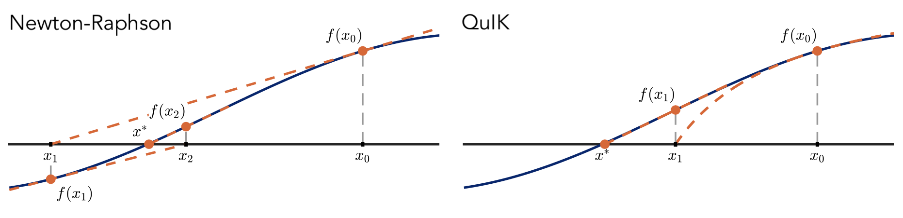
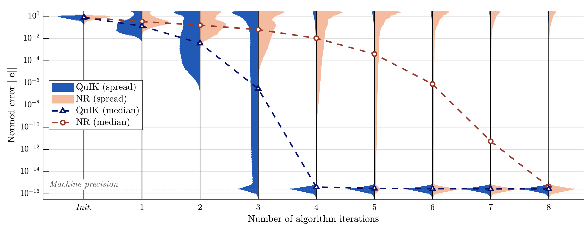

# QuIK: An ultra-fast and highly robust kinematics library for C++ or ROS2 using DH parameters

QuIK is a hyper-efficient C++ kinematics library for serial manipulators. It is based on the novel QuIK algorithm, [published in IEEE-TRO](http://dx.doi.org/10.1109/TRO.2022.3162954), that uses 3rd-order velocity kinematics to solve generalized inverse kinematics significantly faster, and significantly more reliably that existing inverse kinematics packages. QuIK uses the Denevit-Hartenberg convention for kinematics, which is readily available for most manipulators and results in a more computationally efficient formulation of kinematics.

Some key benchmarks over other available solvers, on a sample 6-DOF manipulator with large initial joint error:

| Solver         | Mean Solution Time | Error Rate |
| -------------- | ------------------ | ---------- |
| QuIK           | 21 μs              | 0.13%      |
| KDL (used in ROS, and primary base solver in TracIK)            | 148 μs (x7)       | 5.3% (x40)|
| Matlab Robotics Toolbox        | 670 μs (x32)      | 1.1% (x9) |

When the initial guess is good (close to the true answer), the error rate goes to nearly zero and the solution time decreases significantly.

These benchmarks were published in the IEEE-TRO paper, and further details about them can be found there. A preprint of this paper is included in this repository:  [docs/SLloydEtAl2022_QuIK_preprint.pdf](docs/SLloydEtAl2022_QuIK_preprint.pdf).

> S. Lloyd, R. Irani, and M. Ahmadi, "Fast and Robust Inverse Kinematics for Serial Robots using Halley’s Method," IEEE Transactions on Robotics, vol. 38, no. 5, pp. 2768–2780, Oct. 2022. doi: [10.1109/TRO.2022.3162954](http://dx.doi.org/10.1109/TRO.2022.3162954). A preprint of this paper can be found in the current repository, [docs/SLloydEtAl2022_QuIK_preprint.pdf](docs/SLloydEtAl2022_QuIK_preprint.pdf).

This repository includes the code to use the QuIK algorithm in ROS2, or just in C++ in general. Examples are given in python as well.

## What this repository does and does not do

This repository allows for highly efficient robot kinematics, and in particular inverse kinematics. It is designed for serial manipulators, i.e. manipulators with a single kinematic chain that does not branch. 

It will perform:

 - Highly efficient and robust inverse kinematics against 6-DOF constraints in world frame. E.g. a target tool point and rotation is specified, and joint angles are returned.
 - Forward kinematics
 - Velocity kinematics/Jacobian computation

It does not do:
 - [_Planned_] Null space optimization for robots with more than 6 joints. The code works perfectly for higher-order chains, but will only return "a" solution, not necessarily a solution which is optimal. 
 - [_Planned_] Reduced-order or transformed constraints, where you perhaps care about the tool point, but not rotation, or other combinations thereof.
 - [_Planned_] Feasibility checks. This code base does not check the computed solutions against joint limits, or check whether the target pose can be reached within the robot's speed and acceleration limits.

## Why use generalized inverse kinematics

If you can and have derived the analytic (closed-form) solution to the inverse kinematics for your robot, by all means use it! It will be faster (likely) and more reliable than a generalized solver, which can fail. Generalized inverse kinematics can be used instead, when:
 - You aren't able to derive a closed-form solution, or don't want to.
 - Your robot is kinematically calibrated, so the DH table is perturbed and a closed-form solution doesn't exist.
 - Your robot is too complex to derive a closed form solution, or lacks a spherical wrist allowing for decoupling of the rotational and translational kinematics.
 - You want to perform more complex null-space optimization (planned for future implementation in this repository).

It is worth noting though, that with this implementation of inverse kinematics, if your initial guess is good (e.g. if you use the previous state of the robot), then the algorithm will converge in 5-6 microseconds and with effectively zero error rate. A typical analytical solution will be closer to 1 microsecond. This difference may not be significant enough to make it worthwhile taking the time to derive the full analytical solution.

## How it works

The QuIK repository is based on the QuIK algorith, the full details of which can be found in the paper [docs/SLloydEtAl2022_QuIK_preprint.pdf](docs/SLloydEtAl2022_QuIK_preprint.pdf). QuIK stands for the *Quick Inverse Kinematics* algorithm, which is a new algorithm for generalized inverse kinematics of serial kinematic chains that has been shown to be 1-2 orders of magnitude faster, and more robust (fails less) than other off-the-shelf algorithms.

The key innovation in this work is the use of higher level derivatives in the iterative solver. Most current inverse kinematics solvers use the geometry Jacobian of the kinematic chain in a *damped Newton search*, where at each step the kinematics function of the robot is linearized about a point, and this linear estimate is used to project towards the correct solution. The novelty with the QuIK method is that it uses the first *and* second-order derivatives to approximate the robot's kinematics function as a quadratic curve, which is instead used to project towards the solution. This quadratic curve captures the function much more effectively than the linear estimate, leading to much faster convergence, and fewer cases of the algorithm diverging to an incorrect solution. This is visualized in the image below.



This improved convergence can be shown graphically. In the above-linked paper, 1 million random poses were generated for the 6-DOF KUKA KR6 robot and solved with a Newton-Raphson solver and the QuIK solver. Each algorithm was given an initial guess that was, on average, 45 degrees away from the true answer (on each joint).
The plot below shows the histogram distribution of the normed kinematic error after each algorithm iteration. Here, we see that the QuIK method converges to machine-level precision nearly twice as fast as the Newton algorithm, and leaves a much lower amount of its sampled unconverged at the top.



Further details and benchmarks can be found in the paper: [docs/SLloydEtAl2022_QuIK_preprint.pdf](docs/SLloydEtAl2022_QuIK_preprint.pdf).

## How to build

This repository can be closed directly into the `src` folder of your ros workspace. For optimal performance, build using the release flag. For this type of iterative code, the compiler optimizations make it run about 10x faster. It will work just fine without it, however.
```bash
colcon build --cmake-args -DCMAKE_BUILD_TYPE=Release
```

## Code Description and Usage

The main C++ code is stored in `include/quik` and `src`. The code can be used directly in your C++ projects, or in C++ ros nodes, or by building and running the provided kinematics service node (see below).

**Core QuIK functionality**:
 - `include/quik/Robot.hpp`: Defines the `quik::Robot` class and forward kinematic/jacobian functions.
 - `include/quik/IKSolver.hpp`: Defines the `quik::IKSolver` class and associated inverse kinematics functions.
 - `include/quik/geometry.hpp` and `src/geometry.cpp`: Defines the `quik::geometry` namespace, which includes a number of functions for transforming from twists to homogeneous transforms to quaternion/point representations, etc.
 - `include/quik/utilities.hpp`: Defines the `quik::utilities` namespace, which includes some non-kinematic helper functions.

**ROS2 code**
 - `include/quik/ros_helpers.hpp` and `src/ros_helpers.cpp`: Defines helper functions for using QuIK in ROS, such as service handlers for forward/inverse/velocity kinematics, as well as helper functions for forming and parsing service requests.
 - `src/ros_kinematics_service_node.cpp`: A ROS2 node that defines services for forward, inverse, and velocity kinematics.

**Example code**
 - `src/sample_cpp_usage.cpp`: A simple demo showing how the codebase can be used (ROS-indenpendent).
 - `src/sample_ros_client_node.cpp`: A sample client node for the service server node provided.
 - `src/sample_ros_cpp_node.cpp`: A simple demo of using the QuIK codebase in a ROS node (directly, without using the service node).

**Python code**
 - `python/sample_quik_client_node.py`: A sample python node that calls the kinematics service node provided.
 - `python/quik_service_helpers.py`: A python module that defines helper functions for forming and parsing service requests from the service node.

### Basic Usage

This library does not use URDF like many ROS packages; instead, it builds the robot structure using Denevit-Hartenburg (DH) convention. The DH table is a method to describe the geometry of a robot or a kinematic chain. It uses four parameters - `a`, `alpha`, `d`, and `theta` - to define the spatial relationship between adjacent links in the chain. More information on the DH convention [here](https://users.cs.duke.edu/~brd/Teaching/Bio/asmb/current/Papers/chap3-forward-kinematics.pdf) or [here](https://spart.readthedocs.io/en/latest/DH.html).

#### The ``quik::Robot`` class

In this implementation, we use the Spong notation and numbering convention for the DH table. This means that:

- `a` and `alpha` are the link length and twist angle, respectively, which describe the transformation from one link to the next.
- `d` and `theta` are the link offset and joint angle, respectively, which describe the transformation due to the joint variable.

The DH parameters are arranged in a matrix where each row corresponds to one joint of the robot, and the columns correspond to the `a`, `alpha`, `d`, and `theta` parameters, in that order.

The robot properties are defined as follows:

- `DH`: A DOFx4 matrix of the Denavit-Hartenberg (DH) parameters in the following order:

    ```plaintext
    a_1  alpha_1    d_1   theta_1
    :       :        :       :
    an   alpha_n    d_n   theta_n
    ```
- `linkTypes`: A vector of link types. Each element should be `true` if the corresponding joint is a prismatic joint, `false` otherwise.
- `Qsign`: A vector of link directions. Each element should be `-1` or `1`, allowing you to change the sign of the corresponding joint variable.
- `Tbase`: The base transform of the robot. This is a 4x4 matrix representing the transformation between the world frame and the first DH frame.
- `Ttool`: The tool transform of the robot. This is a 4x4 matrix representing the transformation between the DOF'th frame and the tool frame.

For example, the following code would define the KUKA KR6 manipulator:
```c++
#include "Eigen/Dense"
#include "quik/Robot.hpp"
using namespace Eigen;
// Given as DOFx4 table, in the following order: a_i, alpha_i, d_i, theta_i.
Matrix<double, 6, 4> DH;
DH << 0.025,    -M_PI/2,   0.183,       0,
      -0.315,   0,         0,           0,
      -0.035,   M_PI/2,    0,           0,
      0,        -M_PI/2,   0.365,       0,
      0,        M_PI/2,    0,           0,
      0,        0,         0.08,        0;

// Second argument is a list of joint types
Vector<quik::JOINTTYPE_t,6> linkTypes;
linkTypes << quik::JOINT_REVOLUTE, quik::JOINT_REVOLUTE, quik::JOINT_REVOLUTE, quik::JOINT_REVOLUTE, quik::JOINT_REVOLUTE, quik::JOINT_REVOLUTE;

// Third argument is a list of joint directions
// Allows you to change the sign (direction) of the joints.
Vector<double,6> Qsign;
Qsign << 1, 1, 1, 1, 1, 1;

// Fourth and fifth arguments are the base and tool transforms, respectively
Matrix4d Tbase = Matrix4d::Identity(4,4);
Matrix4d Ttool = Matrix4d::Identity(4,4);

auto R = std::make_shared<quik::Robot<6>>(DH, linkTypes, Sign, Tbase, Ttool);
```

#### The ``quik::IKSolver`` class

To perform inverse kinematics, you need to build an `IKSolver` object that takes a few extra parameters, although for basic usage the default parameters are generally good:
```c++
#include "Eigen/Dense"
#include "quik/Robot.hpp"
#include "quik/IKSolver.hpp"
using namespace Eigen;
// Define the IK options
const quik::IKSolver<6> IKS(
    R, // The robot object (pointer)
    200, // max number of iterations
    quik::ALGORITHM_QUIK, // algorithm (ALGORITHM_QUIK, ALGORITHM_NR or ALGORITHM_BFGS)
    1e-12, // Exit tolerance
    1e-14, // Minimum step tolerance
    0.05, // iteration-to-iteration improvement tolerance (0.05 = 5% relative improvement)
    10, // max consequitive gradient fails
    80, // Max gradient fails
    1e-10, // lambda2 (lambda^2, the damping parameter for DQuIK and DNR)
    0.34, // Max linear error step
    1 // Max angular error step
);
```
For the most part, these defaults above are fairly good start, so you can initialize this object just with:
```c++
const quik::IKSolver<6> IKS(R);
```

The full list of `IKSolver` parameters are:
- `max_iterations` [`int`]: Maximum number of iterations of the
  algorithm. Default: 200
- `algorithm` [`ALGORITHM_t`]: The algorithm to use. 
  Default: `ALGORITHM_QUIK`.
    - `ALGORITHM_QUIK` - QuIK
    - `ALGORITHM_NR` - Newton-Raphson or Levenberg-Marquardt
    - `ALGORITHM_BFGS` - BFGS
- `exit_tolerance` [`double`]: The exit tolerance on the norm of the error. Default: `1e-12`.
- `minimum_step_size` [`double`]: The minimum joint angle step size (normed) before the solver exits. Default: `1e-14`.
- `relative_improvement_tolerance` [double]: The minimum relative iteration-to-iteration improvement. If this threshold isn't met, a counter is incremented. If the threshold isn't met
  `max_consecutive_grad_fails` times in a row, then the algorithm exits. For example, 0.05 represents a minimum of 5% relative improvement. Default: `0.05`.
- `max_consecutive_grad_fails` [int]: The maximum number of relative improvement fails before the algorithm exits. Default: `20`.
- `lambda_squared` [double]: The square of the damping factor, `lambda`.  Only applies to the NR and QuIK methods. If given, these methods become the DNR (also known as Levenberg-Marquardt) or the DQuIK algorithm. Ignored for BFGS algorithm. Recommended to set to a small, positive but nonzero value. Default: `1e-10`.
- `max_linear_step_size` [double]: An upper limit of the error step
  in a single step. Ignored for BFGS algorithm. Default: Uses the `Robot.characteristicLength()` function to automatically estimate an appropriate value from the values in the `DH` table as `0.33*Robot.characteristicLength()`.
- `max_angular_step_size` [double]: An upper limit of the error step in a single step. Ignored for BFGS algorithm. Default: `1`.
- `armijo_sigma` [double]: The sigma value used in Armijo's rule, for line search in the BFGS method. Default: `1e-5`
- `armijo_beta` [double]: The beta value used in Armijo's rule, for line search in the BFGS method. Default: `0.5`

### Templating for fixed size
Both ``quik::Robot`` and ``quik::IKSolver`` are templated with the integer value ``DOF``, the number of degrees of freedom of the robot. The code is designed such that ``DOF`` can be set to any positive integer value, or to ``Eigen::Dynamic`` (or ``-1``) for a variable-length object. If you know the ``DOF`` beforehand, setting it properly rather than using ``-1`` will avoid dynamic memory allocation in all computations, making the code run in a more reliable and constant amount of time for real-time purposes.

## Usage in ROS

QuIK has been integrated into ROS and can be used either via a kinematics service node, or by simply using the C++ code directly. Helper functions have been written to load robot definitions from YAML config files, form service requests, and more.

### Direct C++ Usage
This library can be included and used directly, as with any C++ code. However, certain helper functions are included to help with parsing from YAML files:
```c++
#include "rclcpp/rclcpp.hpp"
#include "quik/IKSolver.hpp"
#include "quik/Robot.hpp"
#include "quik/ros_helpers.hpp"
constexpr int DOF=6;
class SampleCPPUsageNode : public rclcpp::Node
{
public:
    SampleCPPUsageNode() : Node("sample_cpp_usage_node")
    {
        this->R = std::make_shared<quik::Robot<DOF>>(quik::ros_helpers::robotFromNodeParameters<DOF>(*this));
        
        this->IKS = std::make_shared<quik::IKSolver<DOF>>(quik::ros_helpers::IKSolverFromNodeParameters<DOF>(*this, this->R));
    }

    std::shared_ptr<quik::IKSolver<DOF>> IKS;
    std::shared_ptr<quik::Robot<DOF>> R;
};
```

The basic config parameters are loaded from the node's yaml file. You may use one of the provided yaml files in `config/`, or just make your own. At a minimum, the config file requires the DH table definition and a list of the joints:
```yaml
/**:
    ros__parameters:
        # Robot parameters
        # DH table (order a_i, alpha_i, d_i, theta_i)
        dh: [0.025,   -1.5707963268,  0.183,  0.0,
            -0.315,   0.0,            0.0,    0.0, 
            -0.035,   1.5707963268,   0.0,    0.0,
            0.0,      -1.5707963268,  0.365,  0.0,
            0.0,      1.5707963268,   0.0,    0.0,
            0.0,      0.0,            0.08,   0.0]

        # Link types (JOINT_REVOLUTE or JOINT_PRISMATIC)
        link_types: [JOINT_REVOLUTE, JOINT_REVOLUTE, JOINT_REVOLUTE, JOINT_REVOLUTE, JOINT_REVOLUTE, JOINT_REVOLUTE]
```

A simple C++ node implementing this is provided as an example in `src/sample_ros_client_node.cpp`, which can be run as:
```bash
ros2 run quik sample_ros_cpp_node --ros-args --params-file ./src/quik/config/kuka_kr6.yaml # Replace with your own config file
```

### Kinematics Service Node

The file `src/ros_kinematics_service_node.cpp` defines a service node that will load a `Robot` and `IKSolver` from the config file, as in the prior section. The kinematics service can be run as:
```bash
ros2 run quik ros_kinematics_service_node --ros-args --params-file ./src/quik/config/kuka_kr6.yaml # replace with your own config file.
```
This node defines three services.

#### Inverse kinematics service `/ik_service`: 
The IK service uses the interface `srv/IKService.srv`. 
```yaml
# Request
geometry_msgs/Pose target_pose
float64[] q_0 # Initial guesses of the joint angles
---
# Response
float64[] q_star # The solved joint angles
float64[6] e_star # The pose errors at the final solution
int32 iter # The number of iterations the algorithm took
int32 break_reason # The reason the algorithm stopped
bool success # Whether or not the IK was successful
```
In C++, a request can be formed using the helper function included in `ros_helpers.hpp`:
```c++
auto ik_request = quik::ros_helpers::ik_make_request(quat, d, q_perturbed);
auto ik_result = this->ik_client_->async_send_request(ik_request).get();

VectorXd q_star(this->R->dof); Vector<double,6> e_star; int iter; quik::BREAKREASON_t breakReason;
auto success = quik::ros_helpers::ik_parse_response(ik_result, q_star, e_star, iter, breakReason);
```
Similar functions are provided for python and can be seen in use in `python/sample_quik_client_node.py`.

#### Forward kinematics service `/fk_service`: 
The IK service uses the interface `srv/FKService.srv`. 
```yaml
# Request
float64[] q # joint_angles
int32 frame -1 # the requested frame, if ommitted defaults to the tool frame
---
# Response
geometry_msgs/Pose pose
```
In C++, a request can be formed using the helper function in `ros_helpers.hpp`:
```c++
auto fk_request = quik::ros_helpers::fk_make_request(q);
auto fk_result = this->fk_client_->async_send_request(fk_request).get();

Vector4d quat; Vector3d d;
quik::ros_helpers::fk_parse_response(fk_result, quat, d);
```
Similar functions are provided for python and can be seen in use in `python/sample_quik_client_node.py`.


#### Jacobian service `/jacobian_service`: 
The IK service uses the interface `srv/JacobianService.srv`. 
```yaml
# Request
float64[] q # joint_angles
---
# Response
float64[] jacobian # Jacobian matrix
```
In C++, a request can be formed using the helper function in `ros_helpers.hpp`:
```c++
auto jacobian_request = quik::ros_helpers::jacobian_make_request(q);
auto jacobian_result = this->jacobian_client_->async_send_request(jacobian_request).get();

Eigen::MatrixXd jacobian(6, this->R->dof);
quik::ros_helpers::jacobian_parse_response(jacobian_result, jacobian);
```
Similar functions are provided for python and can be seen in use in `python/sample_quik_client_node.py`.

#### Sample C++ client node
These services are called in a sample client node `src/sample_ros_client_node.cpp`, which can be run as:
```bash
ros2 run quik sample_ros_client_node --ros-args --params-file ./src/quik/config/kuka_kr6.yaml # replace with your own config file
```


#### Sample python client node.
A sample python service client is also provided. The code cannot be directly run due to ROS2 not handling packages with both python and C++ nodes well (at least in combination with custom interface definitions). However, the sample code can be found in the `python/` directory, along with helper functions for forming and parsing service requests.

### YAML Config Files

Sample config files are provided in the `config/` directory for the KUKA KR6 robot, the KUKA iiwa7 robot, and the Kinova Jaco robot. All the inputs to the `Robot` and `IKSolver` objects can be specified in these config files. If omitted, a reasonable default value will be used instead.

## Requirements
All functions rely on the [Eigen 3.4](https://eigen.tuxfamily.org) linear algebra library, so you will also need to link to an appropriate library. If you don't have Eigen on your machine, it can be installed with (on ubuntu):
```bash
sudo apt install libeigen3-dev
```

## Citations

If you use our work, please reference our publication below. Recommended citation:

[1] [S. Lloyd, R. A. Irani, and M. Ahmadi, “Fast and Robust Inverse Kinematics of Serial Robots Using Halley’s Method,” IEEE Transactions on Robotics, vol. 38, no. 5, pp. 2768–2780, Oct. 2022.](docs/SLloydEtAl2022_QuIK_preprint.pdf) doi: [10.1109/TRO.2022.3162954](http://dx.doi.org/10.1109/TRO.2022.3162954).

## Commercial Licensing

This repository is published under the AGPL license, which enforces that all derivative works must also be made open source.

For commercial applications where open-source of derivative works is not possible, individual commercial licensing is available for a modest fee. Contact `steffan` dot `lloyd` at `icloud` dot `com` for details.
